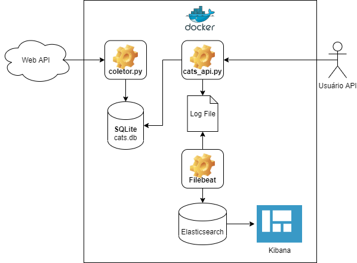
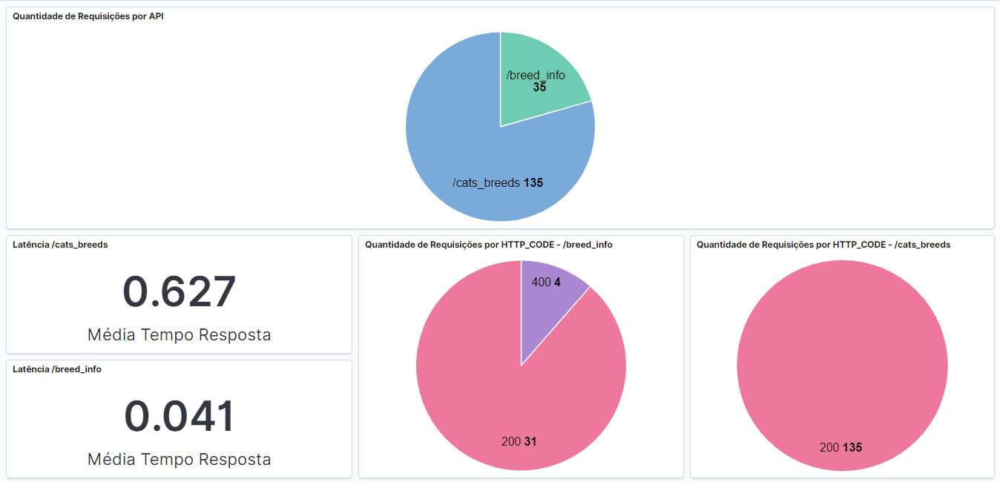

# Cats Case

A aplicação consiste em scripts Python de coleta de dados e uma API para consulta dos dados coletados, os dados coletados ficam armazenados numa base SQLite.
Para a API foi utilizado o framework Flask. Roda em um ambiente Docker utilizando docker compose para orquestrar os servicos.

## Arquitetura



## Instalação

Para subir o ambiente, executar o docker-compose na pasta da aplicação.

```bash
docker-compose up
```

## Uso da API

```bash
curl --location --request GET 'localhost:5000/cats_breeds'
curl --location --request GET 'localhost:5000/cats_breeds?temperament=active'
curl --location --request GET 'localhost:5000/cats_breeds?origin=egypt'
curl --location --request GET 'localhost:5000/cats_breeds?origin=egypt&temperament=active'
curl --location --request GET 'http://localhost:5000/breed_info?breed_name=aegean'
```
## Log API


## Dashboard


